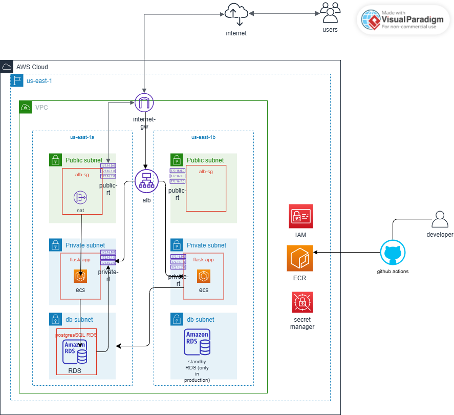

# AWS Cloud-Native Web Application

A production-style multi-AZ AWS architecture built with Terraform, designed to demonstrate real-world DevOps and cloud engineering practices for portfolio purposes.

## Architecture



## Deployment pipeline
```
Deployment pipeline (out-of-band, runs on every push to main):
git push → GitHub Actions ─OIDC─► AWS STS ─► IAM Role
│                                │
▼                                ▼
docker build  ───────────────►  ECR Repository
│
│ pull
▼
ECS Service ─► new task revision
│
▼
Rolling deploy via ALB
```

**Traffic flow:**

- **Inbound (user):** Internet → IGW → ALB (public subnets) → ECS tasks (private, port 8080) → RDS (DB subnets, port 5432)
- **Outbound from private:** Private subnets → NAT Gateway (in public 1a) → IGW → Internet
- **Database isolation:** DB subnets have no `0.0.0.0/0` route — they cannot initiate connections to the internet, preventing data exfiltration if compromised
- **Deployment (out-of-band):** GitHub Actions authenticates via OIDC, builds the image, pushes to ECR, and triggers a rolling ECS deployment

**Cost-vs-availability tradeoff:**  
Single NAT Gateway in `us-east-1a` chosen for cost (~$35/month savings vs. one per AZ). Production deployments would use one NAT per AZ to maintain AZ-level isolation.

## Tech Stack

- **AWS** — VPC, ALB, ECS Fargate, ECR, RDS PostgreSQL, Secrets Manager, IAM, CloudWatch, NAT Gateway
- **Terraform** ≥ 1.5, AWS provider 5.x — infrastructure as code across 5 modules
- **Docker** — multi-stage builds, non-root user, healthcheck
- **GitHub Actions** with **OIDC federation** — short-lived AWS credentials, no static keys
- **Python / Flask** with **gunicorn** and **psycopg2** — application layer
- **Git Bash** on Windows for the development environment

## Project Structure

```
├── main.tf                    # Root module: orchestrates all sub-modules
├── variables.tf
├── outputs.tf
├── terraform.tfvars           # Project-specific values (gitignored)
│
├── app/                       # Flask application
│   ├── app.py
│   ├── schema.sql
│   ├── seed_questions.txt
│   ├── requirements.txt
│   ├── Dockerfile             # Multi-stage, non-root user
│   ├── docker-compose.yml     # Local development
│   └── templates/
│       └── index.html
│
├── modules/
│   ├── networking/            # VPC, subnets, IGW, NAT, route tables
│   ├── security/              # ALB, ECS, DB security groups + rules
│   ├── compute/               # ECS cluster, ALB, task def, service, ECR
│   ├── database/              # RDS, subnet group, Secrets Manager
│   └── cicd/                  # OIDC provider, IAM role, IAM policy
│
└── .github/
└── workflows/
└── deploy.yml         # CI/CD pipeline
```
The root module acts as an orchestrator — calling modules and wiring values between them. Each module is a self-contained unit with explicit inputs and outputs, making it reusable across projects.

## Current State — Phase 4: Application & CI/CD ✅

A complete three-tier AWS web application, deployed automatically through a GitHub Actions pipeline using OIDC federation. Every push to `main` builds the container, pushes it to ECR, and rolls a new ECS task definition revision through the service — with no long-lived AWS credentials anywhere in the system.

## Roadmap

- **Phase 1:** Multi-AZ VPC networking foundation ✅
- **Phase 1.5:** Defense-in-depth security group chain ✅
- **Phase 2:** ECS Fargate compute layer, Application Load Balancer, target groups ✅
- **Phase 3:** RDS PostgreSQL in private DB subnets with credentials in AWS Secrets Manager ✅
- **Phase 4:** CI/CD with GitHub Actions and OIDC federation (no long-lived AWS keys) ✅
- **Phase 5:** Observability — CloudWatch dashboards, alarms, container metrics, structured logging
- **Phase 6:** Documentation polish, video walkthrough, Phase 6 application enhancements (URL-based question routing, likes, user-submitted questions)

### Network Layer

A complete multi-AZ networking layer, fully reproducible from code:

- **Custom VPC** (`10.0.0.0/16`) with DNS support enabled
- **6 subnets across 2 Availability Zones** in 3 tiers:
  - Public (`10.0.0.0/24`, `10.0.1.0/24`) — for the load balancer
  - Private (`10.0.10.0/24`, `10.0.11.0/24`) — for application compute
  - Database (`10.0.20.0/24`, `10.0.21.0/24`) — isolated for RDS
- **Internet Gateway** attached to the VPC
- **NAT Gateway** in a public subnet (single-AZ deployment as a deliberate cost tradeoff for this project — production would use one NAT per AZ)
- **3 route tables** enforcing defense-in-depth:
  - Public route table → IGW
  - Private route table → NAT Gateway
  - Database route table → no internet route at all (only the local VPC route), preventing data exfiltration in case of compromise

### Engineering decisions worth noting

- **`for_each` over `count`** for all repeated resources to avoid index-shift problems
- **Dynamic CIDR computation** using `cidrsubnet()` so subnet allocation auto-adjusts when the VPC CIDR changes
- **`aws_availability_zones` data source** to make the code region-portable
- **`default_tags` at the provider level** to enforce consistent tagging across all resources
- **Tier-first CIDR allocation** (public 0.x, private 10.x, db 20.x) so any IP in a log immediately reveals which tier it belongs to

### Security Layer

A defense-in-depth security group chain enforcing strict traffic flow:

- **ALB Security Group** — accepts HTTP (80) and HTTPS (443) from the internet
- **ECS Security Group** — accepts traffic only from the ALB security group, on the application port
- **DB Security Group** — accepts traffic only from the ECS security group, on the PostgreSQL port (5432)

The chain is enforced through security group references, not IP ranges:

```
   Internet
      │
      │  HTTP (80) / HTTPS (443)
      ▼
┌──────────────┐
│   ALB SG     │
└──────┬───────┘
       │
       │  app port (8080)
       ▼
┌──────────────┐
│   ECS SG     │
└──────┬───────┘
       │
       │  PostgreSQL (5432)
       ▼
┌──────────────┐
│    DB SG     │
└──────────────┘

  Each arrow is a deliberate ingress rule.
  Everything else is implicitly denied.
```
### Security engineering decisions

- **No DB egress rule.** The database security group has zero outbound permissions. Security groups are stateful, so return traffic to ECS connections is allowed automatically — no egress needed for legitimate replies. Blocking egress prevents the database from initiating outbound connections, closing the data exfiltration vector even if the database is compromised.
- **`name_prefix` instead of fixed names.** Combined with `lifecycle { create_before_destroy = true }`, this enables zero-downtime SG replacement. Fixed names cause deadlocks when an SG attached to a running resource needs replacement: AWS won't delete it, and a new SG can't take the same name.
- **Modern rule resources.** Each rule is a separate `aws_vpc_security_group_ingress_rule` or `aws_vpc_security_group_egress_rule` resource. This gives surgical control over rules — adding, removing, or auditing one rule doesn't affect the others. The older inline-rule pattern caused Terraform to try to delete rules added by other tools or teams.
- **Security group references over IP ranges.** Rules say "allow from ECS SG" not "allow from 10.0.10.0/24". The rules describe intent, are immune to IP changes, and remain correct even if subnet CIDRs are renumbered.

### Compute Layer

A containerized application layer running on ECS Fargate behind an Application Load Balancer:

- **ECS Cluster** with Container Insights enabled for detailed metrics
- **IAM Task Execution Role** scoped to ECR pulls, CloudWatch Logs, and Secrets Manager (least privilege)
- **CloudWatch Log Group** capturing all container stdout/stderr with 7-day retention
- **Application Load Balancer** in public subnets, multi-AZ, listening on HTTP/80
- **Target Group** with HTTP health checks, IP-based targets for Fargate compatibility
- **HTTP Listener** forwarding all traffic to the target group
- **ECS Task Definition** specifying the application container, 256 CPU / 512 MB memory, awsvpc network mode
- **ECS Service** maintaining 2 tasks across both private subnets, registered to the target group

### Compute engineering decisions

- **Fargate over EC2 launch type.** No EC2 fleet to patch, scale, or manage. AWS handles the underlying compute. Tasks scale independently and are billed per-second.
- **awsvpc network mode.** Each task gets its own ENI with a private IP and its own security group attachments. This is what makes the per-task firewall chain (ALB SG → ECS SG → DB SG) actually enforceable. In `bridge` or `host` mode, all containers on a host share networking, breaking per-task isolation.
- **`assign_public_ip = false`.** Tasks live in private subnets with no public IPs. Outbound traffic goes through NAT; inbound is filtered by the ECS security group accepting only ALB traffic. Public IPs would be wasted (private subnet routes don't reach IGW anyway) and create misleading architecture signals.
- **Target group `name_prefix` + `lifecycle.create_before_destroy`.** Port changes on a target group force replacement, but a target group can't be destroyed while a listener references it. The combination enables zero-downtime replacement: new TG creates with a unique random name, listener swaps to it, old TG is then safely destroyed.
- **`container_insights = enabled` on the cluster.** Sends per-task CPU, memory, and network metrics to CloudWatch. Costs slightly more but enables real observability in Phase 5.
- **Health check threshold of 2.** More aggressive than the AWS defaults (5/2). Faster failure detection in development; production might use the gentler defaults to avoid flapping.
- **Container logs to CloudWatch with 7-day retention.** Cheap, auto-deleted, sufficient for development. Production would tier retention by log type — application logs at 30 days, audit logs at 90+, compliance logs forever.

### Database Layer

The data layer was the most demanding part of this project — it forced me to navigate security, cost, and AWS Free Tier constraints simultaneously.

A managed PostgreSQL database with credentials stored in Secrets Manager and network isolation enforced through the existing security group chain:

- **DB Subnet Group** — a logical wrapper RDS requires for AZ-aware deployments. Even single-AZ instances need a subnet group spanning multiple AZs, because AWS uses it for backups, maintenance ENIs, and reserves the option to promote to multi-AZ later without rebuilding the network.
- **Random Password** — generated by Terraform's random provider during apply. Never committed to code, never stored in `terraform.tfvars`.
- **AWS Secrets Manager** — stores the database credentials as a JSON bundle (username + password). The application reads them at runtime via IAM permissions instead of receiving them as environment variables.
- **RDS PostgreSQL Instance** — single-AZ `db.t3.micro` running PostgreSQL 15.7, deployed in the database subnets, encrypted at rest, with automated daily backups.

### Database engineering decisions

- **Single-AZ deployment.** Multi-AZ roughly doubles instance cost in exchange for a synchronous standby in a second AZ and 60–120 second automatic failover. For a learning project, single-AZ demonstrates the architecture without the cost. Production with real users would use Multi-AZ.
- **`gp3` storage over `gp2`.** `gp3` separates IOPS, throughput, and storage size as independent dimensions you pay for. `gp2` ties IOPS to disk size, forcing over-provisioning of storage to get the IOPS you need. `gp3` is also roughly 20% cheaper than `gp2` for equivalent performance.
- **Storage encryption at rest.** Enabled with `storage_encrypted = true` using AWS-managed KMS keys. Free, with no operational overhead. Production with stricter compliance requirements would use a customer-managed KMS key for explicit control over rotation and audit.
- **Credentials never in Terraform variables.** The password is generated by the random provider during apply and immediately written to Secrets Manager. The application fetches it at runtime via IAM. The password value does exist in Terraform state, but state is encrypted in S3 with restricted IAM access and is never read by the application.
- **No password output.** Outputs are visible in `terraform output`, in the state file, and in CI/CD logs. Outputting a password would expose it across all three surfaces. The architecture pattern is: outputs expose ARNs and identifiers; sensitive values stay accessible only via IAM-authenticated secret retrieval.
- **1-day backup retention as a Free Tier adaptation.** I initially configured 7-day retention but `terraform apply` failed with `FreeTierRestrictionError` — the Free Tier permits a maximum of 1 day. I adjusted to 1 day for the learning project. Production deployments use 7–30 days, with longer retention for compliance-relevant data.
- **`skip_final_snapshot = true`.** When the instance is destroyed, no final snapshot is taken. Acceptable for a learning project with no real data. In production this would always be `false` — the final snapshot is the last line of defense against accidental destruction.

### Application Layer — Tell Me Your Paradigm

To test the infrastructure I'd been building since the start of this project, I needed a real application to deploy. Rather than writing one myself, I simulated the real-world flow: a developer hands code off, and I — as the cloud/DevOps engineer of the project — deploy it automatically using GitHub Actions. So I prompted Claude Code to generate the codebase.

#### What the application is about

I've always been fascinated by how differently people think about the same problem. Two people can look at the same situation and view it completely differently — one sees a 6, the other sees a 9 (the mirror reflection). There's a saying I like: *"The problem is not the problem itself; the problem is how you view the problem."* That's why I built **Tell Me Your Paradigm** — a small web application with two tables, deployed on AWS. Claude Code generated it in under two minutes.

### CI/CD Layer — GitHub Actions with OIDC

To deploy the application, I used GitHub Actions as the CI/CD platform because it's flexible and integrates directly with my repository. The workflow has the following steps:

- Trigger on push to `main` or manual dispatch
- Check out the code
- Authenticate to AWS using OIDC (OpenID Connect)
- Log in to Amazon ECR
- Build the container image and push it to ECR
- Pull the current ECS task definition and update the container image reference
- Register the new task definition revision
- Update the ECS service to use the new revision (PassRole grants the task execution role)

#### Authenticating to AWS using OIDC

To authenticate with OIDC, I configured the workflow to request an identity token using `id-token: write` from GitHub's OIDC provider — which I had registered in AWS as a trusted federated identity provider. The workflow then exchanges this token for temporary credentials by calling `sts.amazonaws.com`. AWS performs three checks:

1. **Verify the token actually came from GitHub** — the JWT signature must match the registered OIDC provider's public key.
2. **Verify this workflow is allowed to assume the role** — the trust policy's `sub` claim must match `repo:Mallaimy/aws-cloudnative-webapp:*`.
3. **Verify the token is intended for AWS STS** — the `aud` claim must equal `sts.amazonaws.com`.

If all three checks pass, AWS issues short-lived credentials (default 1 hour, max 12 hours).

This is the modern way to handle credentials in GitHub Actions: no long-lived access keys, no manual rotation, no risk of leaked credentials sitting in repository secrets.
#### OIDC authentication flow

```
┌───────────────────────┐                   ┌───────────────────────┐
│ GitHub Actions        │                   │ GitHub OIDC Provider  │
│ Workflow              │ ── 1. Request ──► │                       │
│ permissions:          │     OIDC token    │  signs token with     │
│   id-token: write     │ ◄─── JWT ────────│  GitHub's private key │
└───────────┬───────────┘                   └───────────────────────┘
            │
            │  2. AssumeRoleWithWebIdentity (with JWT)
            ▼
┌───────────────────────────────────────────────────────────────────┐
│ AWS STS                                                           │
│                                                                   │
│   Check 1: JWT signature matches registered OIDC provider?        │
│   Check 2: sub claim matches trust policy (repo + branch)?        │
│   Check 3: aud claim == sts.amazonaws.com?                        │
│                                                                   │
│   All 3 pass → temporary credentials (1h default, 12h max)        │
└───────────┬───────────────────────────────────────────────────────┘
            │
            │  3. Use temp credentials
            ▼
┌───────────────────────┐
│ AWS Resources         │
│  - ECR (push image)   │
│  - ECS (update svc)   │
│  - IAM (PassRole)     │
└───────────────────────┘
```
### CICD engineering decisions

- **OIDC federation over long-lived AWS keys.** OIDC eliminates the classic risks of static IAM access keys in CI/CD: no secrets sitting in repository configuration, no manual rotation, no risk of a leaked key surviving for months. Each workflow run gets short-lived credentials (1 hour by default), scoped to one repository through the trust policy.

- **`iam:PassRole` scoped to one specific role ARN.** Without scoping, a compromised workflow could pass any role in the account to ECS — including admin roles — and inherit those privileges through the container. Scoping `iam:PassRole` to the single task execution role bounds the blast radius. Least privilege at the IAM layer.

- **Image tagging strategy: SHA for production, latest for convenience.** I tag every image with both the full commit SHA and `latest`. The SHA tag is what the task definition references — it's immutable and ties every running container back to the exact commit that produced it, which makes rollback to a previous ECS task definition revision straightforward. The `latest` tag is convenience-only, never used in production deploys.

- **Multi-stage Dockerfile.** I used a multi-stage build to keep the final image lean, but for a pure-Python project the savings are modest. Multi-stage really pays off for compiled languages like Go, Rust, or Java, where the build toolchain is hundreds of megabytes the runtime doesn't need. I kept it here for the pattern, not the size win.

- **Non-root user inside the container.** The container runs as `appuser`, not root. If the application is ever compromised, the attacker is confined to a non-privileged user inside the container — one more layer between them and a container escape.

- **`gunicorn --preload` removed.** I originally added `--preload` so schema initialization would run once in the gunicorn master before workers forked. On Fargate this caused SSL errors — workers were inheriting the parent's open TCP connections to RDS, and PostgreSQL doesn't tolerate that. I diagnosed this with Claude's help by reading the cryptic `SSL SYSCALL error: EOF detected` traces in CloudWatch. The fix: remove `--preload`, let each worker open its own pool, and use `pg_try_advisory_lock` to serialize the one-time seed insertion across workers.

- **`lifecycle.ignore_changes = [container_definitions]` on the task definition.** Terraform creates the initial task definition; from that point forward, CI/CD owns the image tag in `container_definitions`. Without `ignore_changes`, every `terraform apply` would try to revert the image to whatever's in tfvars, fighting the deploy workflow. This boundary lets each tool own what it's best at.

- **`force_delete = true` on ECR for development environments.** By default, ECR refuses to delete a repository that contains images — deliberate friction to prevent accidents. For a learning project where I destroy infrastructure between sessions to control cost, `force_delete = true` makes destroy cycles clean. In production I'd keep the default to make accidental destruction harder.

- **`wait-for-service-stability: true` in the deploy step.** Without this flag, the workflow returns success as soon as the new task definition is registered — but ECS might still be bringing up tasks that fail health checks. The workflow would show green while production is broken. With the flag, the deploy step blocks until ECS confirms steady state, so the pipeline status is honest.

### War stories: bugs I debugged on the way to a working pipeline

Phase 4 was the densest debugging session of the project. Seven distinct production-grade bugs surfaced across two sessions before the pipeline shipped end-to-end. Three are worth documenting because each taught a generalizable lesson about a different layer of the system.

#### Bug 1: KeyError on DB_HOST — the missing env block

**The symptom.**  
After pushing the code, the workflow started but the ECS deployment step failed.

**The diagnosis.**  
I opened the AWS console and looked at the tasks. ECS was rolling back to the nginx image I'd used as a placeholder. I opened the container logs and found `KeyError: 'DB_HOST'`. The application couldn't even read where the database was. The root cause: my ECS task definition resource had no `environment` block at all. Locally with docker-compose it worked because compose injected the variables. Production doesn't lie like that.

**The fix.**  
I added an `environment` block to the task definition. This required updating the database module to expose the values I needed (`db_address`, `db_port`, `db_name`, `db_secret_arn`) and passing them through the root module to the compute module.

**The generalizable lesson.**  
When something fails, listen to what the system is telling you. And when something works locally but breaks in production, environment configuration is almost always where the gap lives.

#### Bug 2: 504 Gateway Timeout — the port mismatch cascade

**The symptom.**  
After fixing Bug 1, I re-ran the workflow. It failed again with a different signal: gunicorn logs showed `Listening at: http://0.0.0.0:8080` followed by clean worker boots, but the tasks were stuck in a crash-restart loop and `curl` to the ALB returned a 504 timeout.

**The diagnosis.**  
The application logs weren't pointing at the problem this time. I had to trace traffic end-to-end. The app was listening on 8080, but the tasks kept failing health checks. I checked the ALB target group and found it was health-checking on port 80 — left over from when I'd used nginx for local testing — while the application was actually listening on 8080.

**The fix.**  
I refactored the application port into a root-level Terraform variable shared between the security and compute modules. Now all references — target group port, security group ingress, container port mapping — stay in sync from a single source of truth.

**The generalizable lesson.**  
A port number is just a value, but in IaC it can appear in three or four different resources that all have to agree. DRY at the IaC level isn't optional — duplicated values across modules will drift, and the failures will look unrelated to the cause.

#### Bug 3: Image not found — short SHA vs full SHA

**The symptom.**  
After fixing Bug 2, I re-ran the workflow. It failed *again*, this time with `CannotPullContainerError: image not found`. I checked the ECR registry — the image was there.

**The diagnosis.**  
The image existed in ECR, but my task definition was pointing at the wrong tag. ECS was looking for an image tagged with the full git commit SHA, but my Terraform configuration was passing a 7-character short SHA. The two strings looked similar but didn't match. Running `aws ecr describe-images` showed the actual tags in the repo, which made the mismatch obvious.

**The fix.**  
I updated `terraform.tfvars` to point at the full SHA so the task definition would resolve to the actual image. From here on, only CI/CD modifies the image tag (Terraform's `lifecycle.ignore_changes` keeps it out of the way), so this drift can't happen again.

**The generalizable lesson.**  
`git log --oneline` shows the short SHA for human readability, but `github.sha` in workflows is always the full 40-character SHA. Mixing the two is silent until something tries to look up an image by tag and finds nothing.

## How to Reproduce

This project deploys to your own AWS account. Because the CI/CD pipeline uses OIDC federation tied to a specific GitHub repository, you need to fork the repo first and update a few values.

```bash
# 1. Fork this repository on GitHub, then clone your fork
git clone https://github.com/Mallaimy/aws-cloudnative-webapp.git
cd aws-cloudnative-webapp

# 2. Configure AWS credentials for the initial bootstrap apply
aws configure

# 3. Update terraform.tfvars with your own values
#    - github_repository = "<your-username>/aws-cloudnative-webapp"
#    - container_image   = "<your-account-id>.dkr.ecr.us-east-1.amazonaws.com/aws-cloudnative-webapp:latest"

# 4. Initialize and review
terraform init
terraform plan

# 5. Apply (creates ~47 resources — VPC, ECS, RDS, ECR, IAM, etc.)
terraform apply

# 6. Push code to your fork's main branch — the workflow will build and deploy automatically

# 7. Destroy when done (avoid NAT Gateway and RDS charges)
terraform destroy
```

## Cost Considerations

This project includes resources that incur real AWS charges. Approximate hourly costs while running:

- **NAT Gateway:** ~$0.045/hour (~$1.08/day) — biggest cost item
- **RDS db.t3.micro:** ~$0.018/hour (~$0.43/day)
- **ECS Fargate (2 tasks @ 256/512):** ~$0.02/hour (~$0.48/day)
- **Application Load Balancer:** ~$0.025/hour (~$0.60/day)
- **Elastic IP:** ~$0.005/hour while allocated
- **ECR storage:** $0.10/GB-month (negligible — images are ~50MB)
- Other resources (VPC, subnets, IGW, route tables, IAM) are free

**Total: roughly $3/day while infrastructure is running.**

Recommended workflow during learning: `terraform destroy` between sessions, `terraform apply` when resuming. This costs near-zero and confirms the code is fully reproducible.

## Project Status

Active development. Built as part of a transition into Cloud/DevOps Engineering roles.

---

Built by [Abakar Mahamat Mallah](https://www.linkedin.com/in/abakar-mahamat-mallah-57b793218/) — AWS Solutions Architect Associate certified.